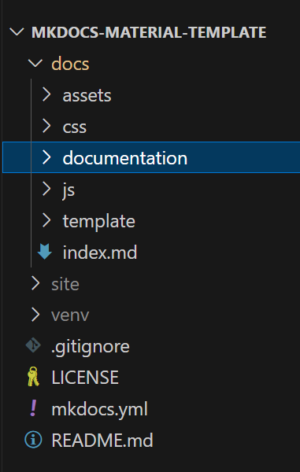

# HAMK's learning material
:material-human-greeting:{.greetings}  
Welcome to the template page for learning material using Mkdocs-material!   
## Template
- The [Template](./template/) is for customization.  

## Example
- The <a href='https://hamk-business-information-technology.github.io/os/index' target='_blank'>BYOD</a> page is an example of applying Mkdocs-material to the BYOD content.

## :material-email-outline: Email
???+ warning  "replace with your email"
    Replace the placeholder with your own email in 2 places  
    - Refer to the documentation [setting up](./documentation/2.settingUp/#email)  

## Documentation
- The [Documentation](./documentation/) is a quick guide for the most frequently used features in this template.  
???+ tip "Delete the `/docs/documentation/` directory and customize the remaining for your new project"
    